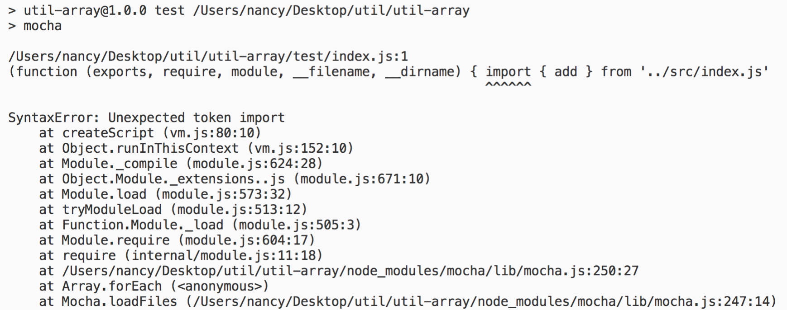
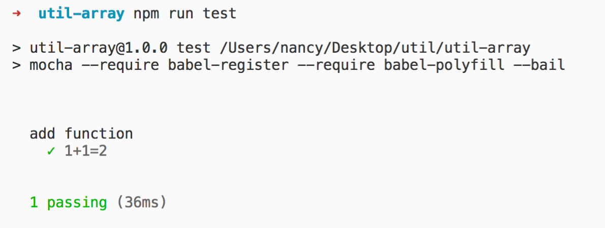

# 让Mocha支持es6语法

Mocha是现在非常流行的JavaScript测试框架，在浏览器和Node环境都可以用。但Mocha默认只支持commonJS的模块系统，即require，exports这种写法，
不支持es6 Module。

Mocha直接引入esModule文件报如下错误



这就导致我们用es6语法写的源码无法import进来直接测试,那我们怎么让它支持呢？

## babel转换

很简单，babel转一下就可以了, 在Mocha中使用babel非常简单!

一般我们会在package.json的scripts里写好运行测试的命令,然后`npm test`就可以跑测试脚本了，Mocha会自动执行test目录的代码，如下

```json
 "scripts": {
    "test": "mocha",
  }
```
为了支持es6语法，加上以下代码
```json
 "scripts": {
    "test": "mocha --require babel-register --bail",
  }
```

然后在项目根目录下的`.babelrc`文件(没有就自己新建一个)里加上如下配置
```
{
  "presets": [
    ["env"]
  ]
}
```
babel会自动读取`.babelrc`配置文件，这样就让我们的Mocha代码支持es6的模块系统和es6的其他语法了.

当然先安装依赖
```bash
npm install babel-register  babel-preset-env -D
```

## Mocha配置说明
Mocha的两个配置`--require`和`--bail`,官方文档是这样说的：

> --require
>
> The --require option is useful for libraries such as should.js, so you may simply --require should instead of manually invoking require('should') within each test file.

意思是`--require`和在代码里手动`require('babel-register')`一样，但写在配置里会作用到每个test文件。默认支持`.es .js .jsx`扩展名.
老版本的Mocha使用`--compilers`命令支持其他文件扩展名，但在4.0后就废弃掉了。

> --bail
>
> Only interested in the first exception? use --bail!

`--bail`可以在第一个异常抛出的时候停止运行测试,这对集成测试很重要。

> About Babel
>
> If your ES6 modules have extension .js, you can npm install --save-dev babel-register and use mocha --require babel-register; --compilers is only necessary if you need to specify a file extension.

`babel-register`可以让Mocha支持ES6 module，就是`import export `写法.

`babel-preset-env`在没有任何配置选项的情况下，与 babel-preset-latest（或者babel-preset-es2015，babel-preset-es2016和babel-preset-es2017一起）的行为完全相同。官方推荐使用`babel-preset-env`.

配置并安装完后就可以跑我们的测试代码了！

