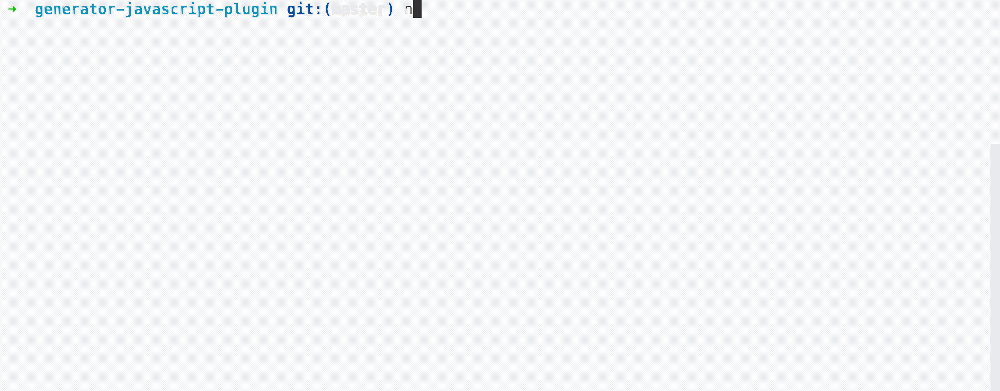

# 用yeoman打造自己的项目脚手架

我们通常都是在在别人的基础上写代码，但如果自己新建项目，却一时不知如何下手。你需要自己设计目录结构，自己写各种配置，自己处理打包编译，而且每次新建个项目就要重来一遍或把原来的项目copy一份改改。那能不能自己写个模板，然后个性化自动创建呢？

这就需要一个脚手架了。什么是脚手架呢？脚手架如同一个项目的模板，可以帮我们快速开始项目，就像vue-cli，提供一个终端的交互界面让用户自定义项目内容。

## yeoman介绍

Yeoman是一个通用的脚手架系统，允许创建任何类型的应用程序（Web，Java，Python，C＃等）。用yeoman写脚手架非常简单，
yeoman提供了yeoman-generator让我们快速生成一个脚手架模板，我们的主要工作就是把模板文件写好。现在我们来用yeoman写一个生成javascript插件的脚手架吧。

脚手架功能：

- 自动构建编译和打包
- 支持es6语法
- 支持单元测试
- 支持jsdoc生成文档
- 支持eslint语法检查
- 自动生成changelog

## 准备工作

首先需要全局安装yo

```bash
npm install -g yo
```
生成脚手架模板
```bash
yo generator
```


在这个终端界面里输入项目名、描述等项目信息。注意项目名称要写成`generator-xxx`的格式，这样用户就可以通过`yo xxx`安装你的脚手架了。

生成的脚手架模板目录结构如下：

```
.
├── generators/
│   └── app/
│       ├── index.js
│       └── templates/
│           └── dummyfile.txt
├── .editorconfig
├── .eslintignore
├── .gitattributes
├── .gitignore
├── .travis.yml
├── .yo-rc.json
├── LICENSE
├── README.md
├── package.json
└── __tests__/
    └── app.js
```

接下来我们就在`generators/app/index.js`里写脚手架的逻辑。

## 编写自己的脚手架

脚手架所做的事情：
- 接收用户输入
- 根据用户输入生成模板文件
- 将模板文件拷贝到目标目录（通常是用户运行脚手架的目录）
- 安装依赖

Yeoman提供了一个基本生成器，你可以扩展它以实现自己的行为。这个基础生成器将帮你减轻大部分工作量。在生成器的index.js文件中，以下是扩展基本生成器的方法：

```javascript
var Generator = require('yeoman-generator');

module.exports = class extends Generator {};
```
yeoman生命周期函数执行顺序如下：

- initializing - 初始化函数
- prompting - 接收用户输入阶段
- configuring - 保存配置信息和文件
- default - 自定义功能函数名称，如 method1
- writing - 生成项目目录结构阶段
- conflicts - 统一处理冲突，如要生成的文件已经存在是否覆盖等处理
- install - 安装依赖阶段
- end - 生成器结束阶段

我们常用的就是initializing、prompting、default、writing、install这四种生命周期函数。看下例子：

```javascript
'use strict';
const Generator = require('yeoman-generator');
const chalk = require('chalk'); // 让console.log带颜色输出
const yosay = require('yosay');
const mkdirp = require('mkdirp'); // 创建目录

module.exports = class extends Generator {

  // 接受用户输入
  prompting() {
    // Have Yeoman greet the user.
    this.log(
      yosay(`Welcome to the grand ${chalk.red('generator-javascript-plugin')} generator!`)
    );

    const prompts = [
      {
        type: 'confirm',
        name: 'someAnswer',
        message: 'Would you like to enable this option?',
        default: true
      }
    ];

    return this.prompt(prompts).then(props => {
      // To access props later use this.props.someAnswer;
      this.props = props;
    });
  }

  // 创建项目目录
  default() {
    if (path.basename(this.destinationPath()) !== this.props.name) {
      this.log(`\nYour generator must be inside a folder named
        ${this.props.name}\n
        I will automatically create this folder.\n`);

      mkdirp(this.props.name);
      this.destinationRoot(this.destinationPath(this.props.name));
    }
  }
  // 写文件
  writing() {
    // 将templates目录的代码拷贝到目标目录
    // templates目录默认路径是generators/app/templates
    this.fs.copy(
      this.templatePath('dummyfile.txt'),
      this.destinationPath('dummyfile.txt')
    );
    this._writingPackageJSON()
  }

  // 以下划线_开头的是私有方法
  _writingPackageJSON() {
    // this.fs.copyTpl(from, to, context)
    this.fs.copyTpl(
      this.templatePath('_package.json'),
      this.destinationPath('package.json'),
      {
        name: this.props.name,
        description: this.props.description,
        keywords: this.props.keywords.split(','),
        author: this.props.author,
        email: this.props.email,
        repository: this.props.repository,
        homepage: this.props.homepage,
        license: this.props.license
      }
    );
  }

  // 安装依赖
  install() {
    this.installDependencies();
  }
};
```

## 编写模板代码

前面我们把一个脚手架的基本框架都写好了，它可以接受用户输入的内容，可以写文件，可以安装依赖，但接收用户输入的数据怎么用？写进什么文件？安装什么依赖呢？这些都是模板文件做的事情。现在就开始最主要的一部分：编写模板文件。

模板文件是你为用户生成的一个项目demo，让用户看着这些示例代码就可以开工了，用户应该只需要专注于业务逻辑，而不用管打包构建这些事。

首先建好模板目录：

```
├── .editorconfig
├── .eslintignore
├── .eslintrc.js
├── .gitignore
├── .babelrc
├── jsdoc.json
├── README.md
├── package.json
├── build/
    └── rollup.js
├── src/
    └── index.js
├── test/
    └── index.js
```

我们的模板`package.json`里已经写好这些命令：

```json
"scripts": {
  "prebuild": "npm run lint && npm run test && npm run doc",
  "build": "node ./build/rollup.js",
  "lint": "eslint --ext .js, src",
  "test": "mocha --require babel-register --require babel-polyfill --bail",
  "changelog": "conventional-changelog -p angular -i CHANGELOG.md -s",
  "doc": "jsdoc -c ./jsdoc.json"
}
```
- `npm run lint` 用eslint进行语法检查，在编译前就避免语法错误和统一代码风格。
- `npm test` 运行单元测试
- `npm run doc` 根据注释生成文档
- `npm run changelog` 根据`git log`生成项目日志，改动记录一目了然
- `npm run prebuild` 编译前的语法检查、 运行测试、生成文档
- `npm run build` 编译打包

我们可以使用`<%= name %>`这样的模板语法使用脚手架中的`context`上下文，无论是用户输入的数据，还是程序自己的变量:

```json
{
  "name": "<%= name %>",
  "description": "<%= description %>",
  "version": "1.0.0",
  "private": false,
  "main": "dist/<%= name %>.umd.js",
  "module": "dist/<%= name %>.es.js",
}
```
详细代码请到[github](https://github.com/greenfavo/generator-javascript-plugin)查看。

## 运行测试用例

为了保证代码的健壮性，我们必须进行单元测试。其实我们用`generator`生成的脚手架代码中已经有测试代码示例了，改成自己的逻辑就可以测试我们的脚手架逻辑了。现在我们来测试下文件是否生成：

```javascript
'use strict';
const path = require('path');
const assert = require('yeoman-assert');
const helpers = require('yeoman-test');

describe('generator-javascript-plugin:app', () => {
  beforeAll(() => {
    return helpers
      .run(path.join(__dirname, '../generators/app'))
      .withPrompts({ someAnswer: true });
  });

  it('creates files', () => {
    assert.file(['build/rollup.js']);
    assert.file(['dist']);
    assert.file(['src']);
    assert.file(['test']);
    assert.file(['package.json']);
    assert.file(['.babelrc']);
    ...
  });
});
```

执行命令

```
npm test
```



## 运行脚手架

到此，我们的脚手架开发完了，接下来实际运行下看看是否正确。

由于我们的脚手架还是本地开发，它尚未作为全局npm模块提供。我们可以使用npm创建全局模块并将其符号链接到本地​​模块。在项目根目录运行:

```bash
npm link
```
这样就可以调用`yo javascript-plugin`运行脚手架了。你可以在终端看到运行过程。


## 发布

写好的脚手架发布出去才能让更多的人使用，发布脚手架和发布其他npm包一样。[如何发布?](./04.md)

## github 地址

`generator-javascript-plugin`这个脚手架已经发布到[npm](https://www.npmjs.com/package/generator-javascript-plugin)上，可以下载或访问源码。

源码地址：[https://github.com/greenfavo/generator-javascript-plugin](https://github.com/greenfavo/generator-javascript-plugin)
